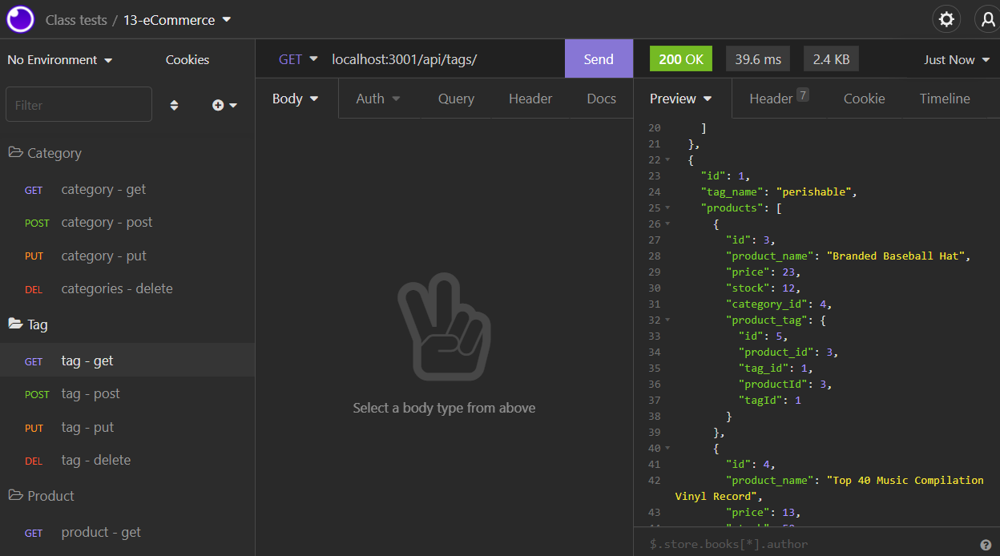

# E-Commerce Back End

## Description
This is a server-side SQL database for creating and managing inventory.

## Installation
This application is hosted via GitHub, and run on the back end using Node.js. From the terminal, use the following script to initialize the program:
```
npm i
```

Before running the application, you'll need to create your database. Using MySQL, run the following code on the db directory:
```
source schema.sql;
```

Next, create an .env file with the following:

```
DB_USER=your MySQL username
DB_PW=your MySQL password
DB_NAME=ecommerce_db
```

If you wish, you may also use seeds.sql to populate the database with starter data. To initialize the database, you can run schema.sql again.

[Demonstration Video: Part 1](https://user-images.githubusercontent.com/56139228/151735586-cf9713ed-af19-4059-9ea5-074deb5169e2.mp4)

[Demonstration Video: Part 2](https://user-images.githubusercontent.com/56139228/151735590-070e0a8a-177c-4782-b02d-0c0896a52422.mp4)

*Note: Several bugs have been resolved since the video was captured, as demonstrated in Video 4.*

[Demonstration Video: Part 3](https://user-images.githubusercontent.com/56139228/151820521-afef485d-08a7-43b2-aca4-2087de2f6270.mp4)

[Demonstration Video: Part 4](https://user-images.githubusercontent.com/56139228/152073793-d847c52a-1eb3-4616-971b-2d1e6fb28878.mp4)


## Usage
Once installed, you can run *node index.js* to initialize the server. From there, the user can input fetch API requests via Insomnia.



From Insomnia, the user can run the follwoing methods on /api/categories, /api/products, or /api/tags.

* get: Look up all items in the category.
* get (/:id): Look up an item by ID.
* post: Add an item to the database.
* put (/:id): Update an item in the database.
* delete (/:id): Remove an item from the database.

As the database is relational, relevant relationships between data (e.g. product tags) will be rendered into the queries. Products and Tags have a many-to-many relationship via the ProductTag subclass.

## Tools Used
* JavaScript
* MySQL
* Sequelize
* Express.js
* Node.js
* NPM
* nodemon
* GitHub
* GitBash
* Coded in VS Code

## Future Functionality
The fetch requests in this are already pretty robust. What I think the application would benefit most from are updates to the models (with new routes) and more robust relationships between those models. That way, users could gather more useful, relevant information and correlate it easily.
